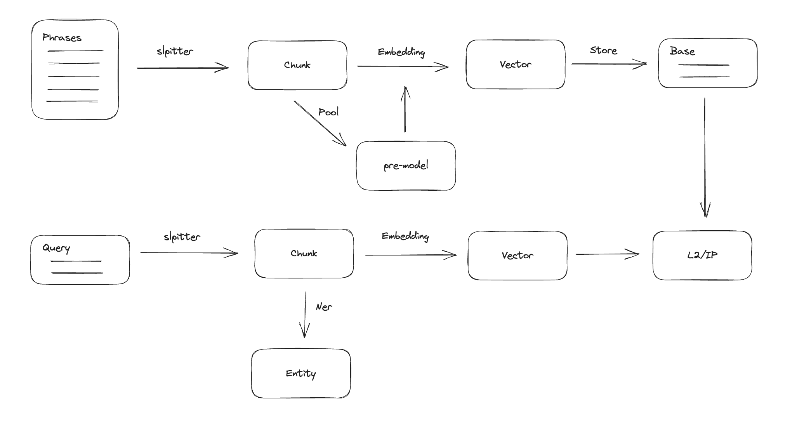

# Simatcher
## Introduction
This is lite nlp frame, it refers to data processing pipeline thinking and incorporates the related capabilities of LLM.

I drew on the design ideas of the Project Rasa nlu module code，add Langchain's LLM processing logic.

Through this project, you can quickly build your personal knowledge base and use LLM to summarize and reason about the results.

The LLM models that can be used here depend on the models that langchain can support. You can inherit the LLM class of langchain and add your own model.
​
## Design

## Engine
### Intent

## Component
Native component
```
├── demo2.py
├── demo.py
└── splitters
|   └── langchan_splitter
|               └── ChineseRecursiveTextSplitter (from langchain-chatglm)
|               └── TextSplitter
└── fearturizrs
|   └── bert_featurizer
|               └── all-MiniLM-L6-v2
|               └── sber-chinese-general
|               └── text2vec-base-chinese
└── classifiers
|   └── faiss
|         └── l2     
|         └── cosine
└── extractors
|   └── regex
└── refine
    └── chatglm  
    └── jarvis    
```
## How to Use
### Environment Installation
First, you need to download this repository:
```shell
git clone https://github.com/xiashuqin89/simatcher
cd simatcher
```
Then use pip to install the dependencies:
```
pip install -r requirements.txt
```
Download encoder mode
```
mkdir model && cd model
# sbert-chinese-general-v2
git clone https://huggingface.co/DMetaSoul/sbert-chinese-general-v2
# text2vec-base-chinese
git clone https://huggingface.co/shibing624/text2vec-base-chinese
```
### build your pipline
Do a config
```
{
    "language": "zh",
    "training_data": "",
    "pipeline": [
        {
            "name": "LangchainSplitter",
            "classifier_file": "LangchainSplitter.pkl",
            "class": "simatcher.nlp.splitters.LangchainSplitter",
            "chunk_size": 100,
            "chunk_overlap": 0,
            "zh_title_enhance": False
        },
        {
            "name": "LangchainFeaturizer",
            "classifier_file": "LangchainFeaturizer.pkl",
            "class": "simatcher.nlp.featurizers.LangchainFeaturizer",
            "pre_model": "text2vec-base-chinese"
        },
        {
            "name": "LangchainClassifier",
            "classifier_file": "LangchainClassifier.pkl",
            "class": "simatcher.nlp.classifiers.LangchainClassifier",
            "knowledge_base_id": "default",
            "top_k": 4,
            "score_threshold": 1,
            "with_score": True
        },
        {
            "name": "SummaryRefiner",
            "class": "simatcher.nlp.refiners.SummaryRefiner",
            "llm_model": "chatglm2-6b",
            "endpoint_url": "http://127.0.0.1",
            "api_key": "xxx",
            "model": "xxxx",
            "history": [],
        }
    ],
    "version": "0.0.0"
}
```